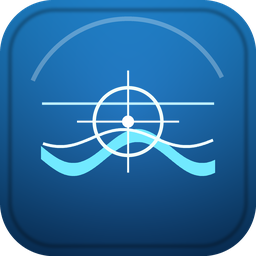

# SeaLegs

Languages: [English](README.md) | [한국어](README.ko.md)

<p align="center">
  
</p>

<p align="center">
  <a href="https://ko-fi.com/dawncr0w">Support my work on Ko-fi</a>
</p>

SeaLegs is a privacy-first macOS menu bar app that adds a transparent overlay for visual comfort on top of 3D games. It can show a soft edge vignette, center reference dot, minimal crosshair, horizon guide, dashboard frame, virtual nose, and peripheral frame to help reduce visual discomfort while playing.

SeaLegs can also use Screen Recording permission for an optional Adaptive mode. In Adaptive mode, it analyzes low-resolution screen motion locally on your Mac, converts frames into numeric motion metrics, and adjusts overlay strength automatically. It does not store screenshots, video, audio, OCR output, typed text, key strings, or raw mouse paths.

SeaLegs is not a medical device. It does not diagnose, treat, or prevent motion sickness. If you experience severe dizziness, vomiting, headache, visual symptoms, or other discomfort, stop playing and rest.

## Important Safety Notice

SeaLegs is an overlay utility. It is not an anti-cheat bypass, cheat tool, game automation tool, memory patcher, injector, or gameplay modifier.

Use SeaLegs at your own risk with online games, competitive games, and games protected by anti-cheat systems. Some games may restrict overlays, screen capture, accessibility helpers, or unsigned/notarized apps. The project maintainers are not responsible for account restrictions, matchmaking penalties, bans, data loss, gameplay issues, or other consequences caused by using SeaLegs with a game or platform.

Do not use SeaLegs to bypass anti-cheat systems, modify game memory, automate gameplay, gain unfair advantage, or violate a game's terms of service.

## Supported Environment

- Supported: Apple Silicon Mac, macOS 14 or later
- Recommended: windowed or borderless-window games
- Limited: some native fullscreen games may not show overlays because of macOS Spaces behavior
- Unsupported: Windows, Linux, VR, anti-cheat bypassing, game memory patching, gameplay automation

## Install SeaLegs

The downloadable DMG is ad-hoc signed with Hardened Runtime, but it is **not**
signed with an Apple Developer ID and is **not** notarized by Apple. Gatekeeper
will therefore show an unidentified-developer warning on first launch.

1. Download `SeaLegs-0.2.0-arm64.dmg` and `SHA256SUMS.txt` from
   [GitHub Releases](https://github.com/DAWNCR0W/SeaLegs/releases).
2. In Terminal, open the download directory and verify the artifact:

   ```bash
   shasum -a 256 -c SHA256SUMS.txt
   ```

3. Open the DMG and drag `SeaLegs.app` to `Applications`.
4. Try to open SeaLegs once. macOS is expected to block this first attempt.
5. Open System Settings > Privacy & Security, scroll to Security, and click
   `Open Anyway` for SeaLegs. Confirm with your Mac password or Touch ID.
6. Open SeaLegs again and follow the in-app permission guidance if you want to
   use Adaptive mode or the optional input signal.

Do not disable Gatekeeper globally. The `Open Anyway` exception applies only
to this copy of SeaLegs. Because ad-hoc signatures identify individual builds,
an update may require you to allow SeaLegs again and re-enable Screen Recording
(called Screen & System Audio Recording on some macOS versions) or Input
Monitoring before reopening the app and pressing `Refresh`.

## What SeaLegs Does

SeaLegs helps you add stable visual references to games that move quickly or use strong camera effects.

Core features:

- Menu bar app with quick access to settings and overlay actions
- Transparent click-through overlay that can follow the game window as it
  moves or resizes, target the active game display, or cover all displays
- Soft edge vignette for reducing peripheral motion intensity
- Center dot and minimal crosshair for stable visual reference
- Horizon guide for driving, flying, and large camera turns
- Dashboard frame and virtual nose for cockpit-like grounding
- Peripheral frame for subtle screen boundary awareness
- Manual strength modes: Off, Low, Medium, High
- Optional Adaptive mode that adjusts strength from local motion analysis
- Game profiles and presets for different game categories
- Feature demo that shows all visual aids at high contrast for 12 seconds
- Hotkeys for overlay toggle, strength changes, emergency mode, discomfort rating, and debug HUD
- Local-only numeric session logs and reports
- Game settings checklist for common comfort-related options
- Calibration and diagnostics export
- Per-profile center-dot and crosshair positioning
- Portable `.sealegsprofile` import and export with conflict review
- Privacy-preserving compatibility checks and copyable support reports
- Optional launch at login through macOS Login Items

## How It Works

SeaLegs has two main operating modes.

### Manual Overlay

Manual modes do not require Screen Recording permission.

1. SeaLegs creates a transparent macOS overlay window above the game.
2. The overlay ignores mouse and keyboard input, so clicks continue to go to the game.
3. You choose Low, Medium, or High strength from the menu bar or Settings.
4. SeaLegs draws the selected vignette and visual reference elements with Metal.

### Adaptive Overlay

Adaptive mode requires Screen Recording permission.

1. SeaLegs captures a low-resolution view of the active game screen.
2. The frame is reduced in memory for analysis.
3. SeaLegs estimates peripheral motion, horizontal/vertical motion, zoom-like expansion, rotation-like movement, and repeating motion patterns.
4. The motion score is smoothed over time.
5. The overlay becomes stronger when motion risk rises and softer when the screen is stable.
6. Raw frames are discarded after analysis.

Adaptive mode is designed for comfort tuning, not game analysis, cheating, or automation.

## Quick Start

1. Build or install SeaLegs.
2. Launch the app.
3. Click the SeaLegs icon in the macOS menu bar.
4. Choose `Show Feature Demo` to confirm the overlay is visible.
5. Open Settings > Overlay and choose a mode.
6. If you want automatic strength adjustment, open Settings > Adaptive and grant Screen Recording permission.
7. Add the current game as a profile from the menu bar if you want automatic game matching.
8. Choose `Game Window`, `Active Game Display`, or `All Displays` in Settings > General.

If an existing saved profile feels too subtle, use `Apply Recommended Visual Aids` in Settings > Overlay.

## Privacy

Screen Recording permission is only required for Adaptive mode. Basic overlay and manual modes work without Screen Recording permission.

Input Monitoring permission is optional and off by default. If enabled, it is used only as an auxiliary turn signal. SeaLegs remembers this opt-in and starts the signal automatically after permission has been granted and the app is reopened.

SeaLegs does not store:

- Screenshots
- Video
- Audio
- OCR output
- Typed text
- Key strings
- Raw mouse paths
- Raw capture frames

Local files:

- `~/Library/Application Support/SeaLegs/profiles.json`: game profiles and overlay settings
- `~/Library/Application Support/SeaLegs/settings.json`: language, telemetry, and privacy settings
- `~/Library/Application Support/SeaLegs/Sessions/*.jsonl`: numeric motion samples, profile identifiers, permission state, optional discomfort ratings, and emergency-mode events

Session logs are retained for 14 days by default and can be disabled or deleted in Settings > Privacy.

Diagnostics export includes numeric state and salted hashes only. It should not include screenshots, video, OCR output, typed text, raw app identifiers, or full executable paths.

## Default Hotkeys

- Toggle overlay: `Option + Command + F10`
- Increase strength: `Option + Command + F11`
- Decrease strength: `Option + Command + F9`
- Emergency comfort: `Option + Command + F12`
- Record discomfort rating: `Control + Option + Command + S`
- Debug HUD: `Control + Option + Command + D`

All core actions are also available from the menu bar.

## Build

```bash
bundle install
cd SeaLegs
BUNDLE_GEMFILE=../Gemfile bundle exec ruby Scripts/generate_xcodeproj.rb
xcodebuild -project SeaLegs.xcodeproj -scheme SeaLegs -destination 'platform=macOS' build
```

Build the ad-hoc signed Apple Silicon DMG used for 0.x releases from
a clean Git worktree:

```bash
cd SeaLegs
./Scripts/build_dmg.sh
```

Artifacts are written to `dist/v0.2.0/` by default. The script verifies
the app version, build number, architecture, Hardened Runtime signature, DMG
contents, and SHA-256 checksum before publishing the final files.

For more stable local permission behavior, generate the project with your Apple development team:

```bash
cd SeaLegs
SEALEGS_DEVELOPMENT_TEAM="<TEAM_ID>" BUNDLE_GEMFILE=../Gemfile \
  bundle exec ruby Scripts/generate_xcodeproj.rb
xcodebuild -project SeaLegs.xcodeproj -scheme SeaLegs -destination 'platform=macOS' build
```

## Test

```bash
cd SeaLegs
xcodebuild -project SeaLegs.xcodeproj -scheme SeaLegs -destination 'platform=macOS' test
```

## Run Locally

```bash
cd SeaLegs
xcodebuild -project SeaLegs.xcodeproj -scheme SeaLegs -destination 'platform=macOS' build
open ~/Library/Developer/Xcode/DerivedData/SeaLegs-*/Build/Products/Debug/SeaLegs.app
```

After launching, use the SeaLegs menu bar icon to open Settings. Start with `Show Feature Demo` so you can confirm that center dot, crosshair, horizon guide, dashboard frame, virtual nose, and peripheral frame are all rendering correctly.

## Screen Recording Troubleshooting

If Adaptive mode does not work or Screen Recording remains `Not Granted`:

1. In SeaLegs Settings > Adaptive, click `Request Access`.
2. In System Settings > Privacy & Security > Screen Recording, enable SeaLegs.
3. If macOS asks for it, quit and reopen SeaLegs.
4. Return to Settings > Adaptive and click `Refresh`.

If an active capture stream is interrupted, SeaLegs falls back to the basic
overlay and retries a limited number of times. Sleeping and waking the Mac also
re-evaluates the active game and restarts Adaptive mode when it is still
applicable.

If frames stop arriving without an explicit ScreenCaptureKit error, the status
changes to `Waiting for samples` automatically. Hiding the overlay also stops
Adaptive capture; editing a profile while hidden does not restart it.

If permission state is stuck during development, reset it:

```bash
tccutil reset ScreenCapture com.dawncrow.SeaLegs
```

Then reopen SeaLegs and request permission again.

## Release and Notarization

SeaLegs 0.x downloads are distributed without Developer ID signing or Apple
notarization. Every release includes the manual Gatekeeper instructions above,
an SHA-256 checksum, and a build manifest. The planned 1.0 release will use
Developer ID signing and Apple notarization before it is presented as a stable release.

See [RELEASE.md](RELEASE.md) for the release process.

## Open Source

SeaLegs is prepared for open-source publication under the MIT License.

- License: [LICENSE](LICENSE)
- Contributing guide: [CONTRIBUTING.md](CONTRIBUTING.md)
- Security policy: [SECURITY.md](SECURITY.md)
- Support policy: [SUPPORT.md](SUPPORT.md)
- Code of conduct: [CODE_OF_CONDUCT.md](CODE_OF_CONDUCT.md)
- Changelog: [CHANGELOG.md](CHANGELOG.md)
- Roadmap: [ROADMAP.md](ROADMAP.md)
- Architecture: [docs/ARCHITECTURE.md](docs/ARCHITECTURE.md)
- Privacy design: [docs/PRIVACY.md](docs/PRIVACY.md)
- Development guide: [docs/DEVELOPMENT.md](docs/DEVELOPMENT.md)

## Icon Assets

- App icon: `SeaLegs/SeaLegs/Assets.xcassets/AppIcon.appiconset`
- Menu bar icon: `SeaLegs/SeaLegs/Assets.xcassets/MenuBarIcon.imageset`
- Accent color: `SeaLegs/SeaLegs/Assets.xcassets/AccentColor.colorset`
- Generator: `SeaLegs/Scripts/generate_app_icon.py`

To regenerate icon assets:

```bash
cd SeaLegs
python3 Scripts/generate_app_icon.py
BUNDLE_GEMFILE=../Gemfile bundle exec ruby Scripts/generate_xcodeproj.rb
```
